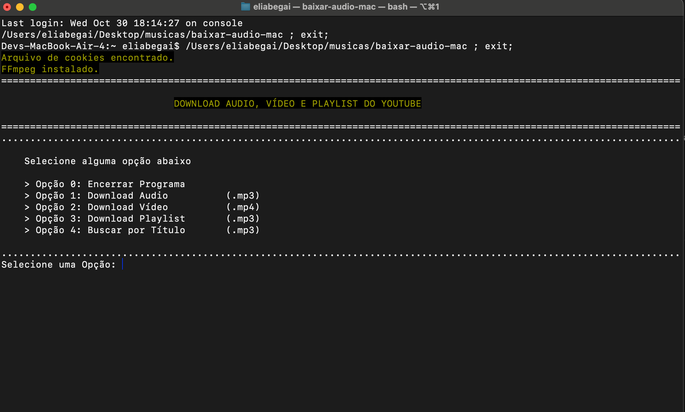
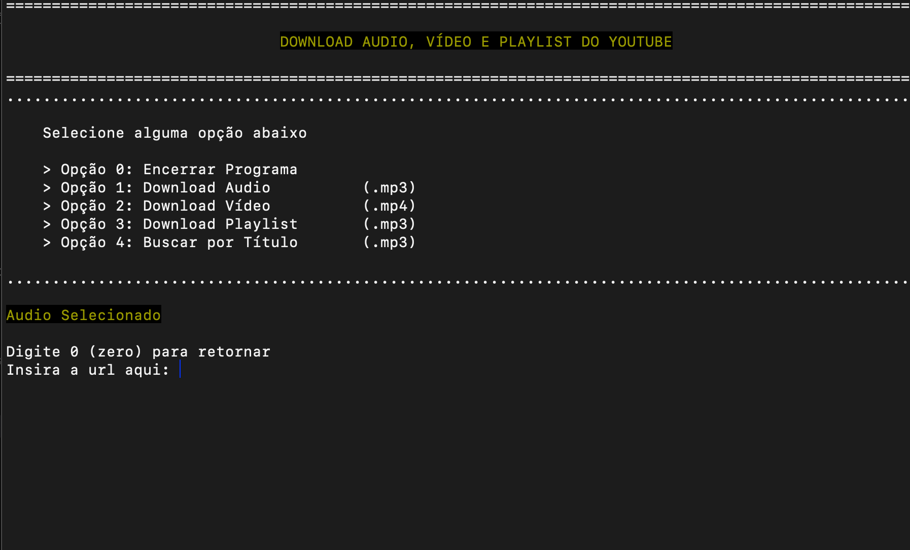

# YouTube to MP3 Downloader

Este projeto permite baixar vídeos do YouTube e convertê-los para MP3 usando `yt-dlp`.

Projeto para estudo de python e também fácilitar o download de músicas para algumas situações, onde que pela interneet é mais lento.
No momento tem apenas a opção de baixar em `.mp3`, mas vou adicionar mais opções confome o tempo.

---
# Download

### Mac
[Baixar Executável](dist/mac/2_1/baixar-audio-mac)

### Windows
[Baixar Executável](dist/windows/2_0/baixar-audio-windows.exe)

---
## Featured Features
1. [x] Selecionar opções como `.mp3`, `.wav`, `.mp4`, entre outros;
2. [ ] Force installation `ffmpeg` caso não tenha no computador. Windows ou Mac;
3. [ ] Opção para alterar o nome do arquivo baixado;
4. [ ] Opção para usar sem os cookies, colocar um alerta falando que pode ser necessário do arquivo para baixar certas músicas ou playlists;
5. [ ] Monitorar a pasta se foi adicionado o arquivo `coockies.txt;
 
---
## Instalação

- Baixe os cookies do youtube com sua conta logada para facilitar o processo de download e também poder baixar playlist privada.
- Salvar o arquivo no mesmo caminho do executável com o nome `cookies.txt`
- Executar arquivo.


## Uso

1. **Execute o script Python:**
    
    Selecione uma das opções de download
     


2. **Insira a URL do vídeo do YouTube:**

    Exemplo: Opção 1: **Áudio**
    

3.

---

## Pré-requisitos

- Python 3.10 ou superior
- `pip` (gerenciador de pacotes Python)

1. **Clone o repositório ou faça o download dos arquivos do projeto.**

2. **Instale as dependências necessárias:**

    Abra o terminal e navegue até o diretório do projeto. Em seguida, execute o comando:

    ```bash
        pip install -r requirements.txt
    ```

3. **Verifique e configure o `ffmpeg`:**

    Certifique-se de que o `ffmpeg` esteja instalado e disponível no `PATH` do seu sistema.

    - **No Windows**: Baixe o `ffmpeg` de [ffmpeg.org](https://ffmpeg.org/download.html) e adicione o diretório `bin` ao `PATH`.
       ```bash
       winget install "FFmpeg (Essentials Build)"
       ```

    - **No macOS**: Instale o `ffmpeg` usando `brew`:

        ```bash
        brew install ffmpeg
        ```

    - **No Linux**: Instale o `ffmpeg` usando o gerenciador de pacotes da sua distribuição, por exemplo:

        ```bash
        sudo apt update
        sudo apt install ffmpeg
        ```
---
## Uso

1. **Execute o script Python:**

    No terminal, navegue até o diretório do projeto e execute o script:

    ```bash
    python baixar_audio.py
    ```

2. **Insira a URL do vídeo do YouTube:**

    Quando solicitado, insira a URL do vídeo do YouTube que deseja baixar e converter para MP3.

3. **O áudio será baixado e convertido para MP3:**

    O arquivo MP3 será salvo no diretório atual.
   
4. **Criar Executável MAC**
    - Required `pyinstaller`

    ```bash
    pyinstaller --onefile --name=baixar-audio-mac --distpath dist/mac/2_1 ./src/baixar_audio.py
    ```

    - permissão para rodar no mac
    ```bash
    chmod +x pasta_atual/baixar-audio-mac
    ```

   **/dist/mac**
   > Arquivo executável para download dos audios.

5. **Criar Executável Windows**
    - Required `pyinstaller`
    ```bash
    python -m PyInstaller --onefile --name=baixar-audio-windows --distpath dist/windows/2_1 ./src/baixar_audio.py
    ``` 

    **/dist/windows**
   > Arquivo executável para download dos audios.
